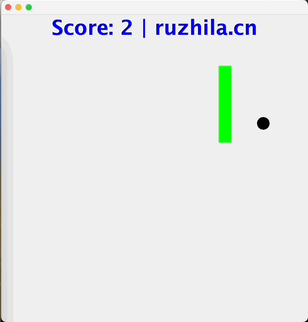

# A snake game using swing, 100 lines java code

By [ruzhila.cn](http://ruzhila.cn/?from=github_snake), a campus for learning backend development through practice.

This is a tutorial code demonstrating how to use Java write game. Pull requests are welcome. 👏



## Usage
```bash
javac SnakeGame.java
java SnakeGame
```

